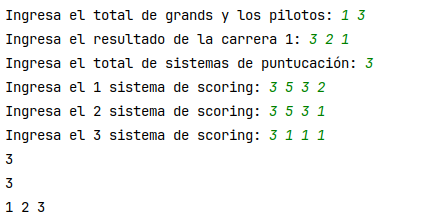

# Primer Ejercicio

## Estructura del proyecto.

```
└── 📁ejercicio_2
    └── main.py
    └── 📁output
        └── test_calculate_champion.txt
        └── test_get_grand_pilots_invalid_input.txt
        └── test_get_grand_pilots_valid_input.txt
        └── test_get_total_scoring_invalid_input.txt
        └── test_get_total_scoring_valid_input.txt
        └── test_result_race_invalid_input.txt
        └── test_result_race_valid_input.txt
    └── output.txt
    └── problema.txt
    └── readme.md
    └── test_main.py
```

Nota: Las pruebas unitarias fueron creadas para correr con pytest. Hay varios métodos que tienen diferentes verificaciones, es por eso que se creó  la carpeta output, donde cada archivo .txt es el resultado de las pruebas unitarias.

## Correr el código

1. Para correr el código necesita hacer lo siguiente.
2. Estar en la carpeta raiz.
3. correr el siguiente comando `python  ejercicio_2/main.py `
4. Acto seguido El programa pedirá el total los números de grands y total de piloto, la información de llegada para cada grand, luego pedirá cuantos sistemas de scorings quieres probar y posteriormente le pedirá uno por uno. Recurda que el programa fianliza cuando se ingresé o cero  en pilotos o cero grands

   En la siguiente imagen se muestra un ejemplo del código
   
