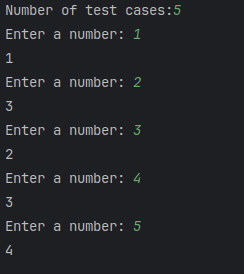

# Primer Ejercicio

## Estructura del proyecto.

```

└── 📁ejercicio_3

    └── jumping_count.py

    └── 📁output

        └── test_examples.txt

        └── test_get_first_value.txt

        └── test_get_numbers.txt

        └── test_jumping_count.txt

    └── output.txt

    └── problema.txt

    └── readme.md

    └── test_jumping_count.py

```

Nota: Las pruebas unitarias fueron creadas para correr con pytest. Hay varios métodos que tienen diferentes verificaciones, es por eso que se creó  la carpeta output, donde cada archivo .txt es el resultado de las pruebas unitarias.

## Correr el código online

[](https://codespaces.new/Frorozcoloa/GBM)

## Correr el código

1. Para correr el código necesita hacer lo siguiente.
2. Estar en la carpeta raiz.
3. correr el siguiente comando `python ejercicio_3/jumping_count.py  `
4. Acto seguido El programa pedirá el total de pruebas que vas a realizar. Despues de ingresar las pruebas y te pedirá los números uno por uno e imprimiendo los números.
   En la siguiente imagen se mostrará un caso de prueba

   
