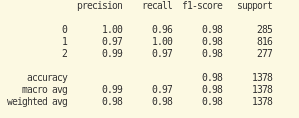

# Primer Ejercicio

## Estructura del proyecto.

`└── 📁ejercicio_4     └── data_customer_classification 1.xlsx     └── feature_engeenier.py     └── 📁image         └── 📁readme             └── 1710647532614.png     └── 📁output         └── test_create_target.txt         └── test_dropdataset.txt         └── test_pretransform_peridoc.txt         └── test_q25.txt         └── test_q50.txt         └── test_q75.txt         └── test_transform_date.txt         └── test_transform_peridic.txt         └── test_transform_tran_amount.txt     └── output.txt     └── problema.txt     └── readme.md     └── test_feature_engeenier.py     └── train.py`

Nota: Las pruebas unitarias fueron creadas para correr con pytest. Hay varios métodos que tienen diferentes verificaciones, es por eso que se creó  la carpeta output, donde cada archivo .txt es el resultado de las pruebas unitarias.

## Feature engeenier

En la estructura de las carpetas hay un dataset donde sea crea un pipeline de la ingeniería de caracterisiticas. Las transformaciones que le vamos a hacer al dataset son las siguientes fuciones

función en el código:

#### Funciones de Cuantiles (`q25`, `q50`, `q75`)

Estas funciones calculan el percentil 25, 50 (mediana) y 75 de una serie de pandas respectivamente.

#### Función `read_df`

Lee un archivo Excel llamado "data_customer_classification 1.xlsx" que se encuentra en el mismo directorio que el script y devuelve el DataFrame correspondiente.

#### Función `pretransform_peridoc`

Transforma la columna "trans_date" del DataFrame en seno y coseno del día de la semana, representados como "weekday_sin" y "weekday_cos" respectivamente.

#### Función `transform_peridic`

Agrupa el DataFrame por "customer_id" y calcula la media, desviación estándar, cuantiles 25, 50 y 75 de las columnas "weekday_sin" y "weekday_cos" para cada cliente.

#### Función `transform_date`

Agrupa el DataFrame por "customer_id" y calcula la fecha mínima, desviación estándar, fecha máxima y rango (diferencia entre la fecha máxima y mínima) de la columna "trans_date" para cada cliente.

#### Función `transform_tran_amount`

Agrupa el DataFrame por "customer_id" y calcula el mínimo, desviación estándar, máximo y media de la columna "tran_amount" para cada cliente.

#### Función `create_target`

Crea la variable objetivo "type_consumer" basada en los percentiles 25 y 75 del número de transacciones de cada cliente. Los clientes se clasifican como tipo 0 si están por debajo del percentil 25, tipo 1 entre el percentil 25 y 75, y tipo 2 por encima del percentil 75.

#### Función `dropdataset`

Elimina la columna "customer_id" del DataFrame.

#### Función `extract_feature`

Es la función principal que ejecuta todas las transformaciones y operaciones anteriores en el DataFrame para extraer las características deseadas.

En resumen, el código realiza una serie de operaciones de preprocesamiento y transformación en un conjunto de datos para obtener características relevantes y crear una variable objetivo para el análisis posterior.

## Entrenamiento del modelo

El código proporcionado se encarga de construir, entrenar y evaluar una red neuronal utilizando TensorFlow y Keras para un conjunto de datos previamente procesado. A continuación, se detalla qué hace cada función en el código:

#### Función `create_train_test`

Esta función utiliza la función `extract_feature` del módulo `feature_engineer` para obtener un DataFrame con características preprocesadas. Luego, separa las características (`X`) de la variable objetivo (`y`), estandariza las características utilizando `StandardScaler`, y divide el conjunto de datos en conjuntos de entrenamiento y prueba utilizando `train_test_split`. Devuelve los conjuntos de datos de entrenamiento y prueba (`X_train`, `X_test`, `y_train`, `y_test`).

#### Función `create_nn`

Esta función crea una red neuronal secuencial utilizando Keras. La arquitectura de la red consta de una capa densa con 64 neuronas y activación ReLU, seguida de una capa densa con 32 neuronas y activación ReLU, y finalmente una capa densa con 3 neuronas de salida y activación softmax para clasificación en 3 categorías.

#### Función `train`

Esta función entrena el modelo de red neuronal utilizando el optimizador Adam y la pérdida `sparse_categorical_crossentropy`. Utiliza los conjuntos de datos de entrenamiento (`X_train`, `y_train`) durante un número especificado de épocas y con un tamaño de lote de 32.

#### Función `evaluate`

Esta función evalúa el modelo entrenado utilizando los conjuntos de datos de prueba (`X_test`, `y_test`). Utiliza el modelo para predecir las etiquetas de las muestras de prueba y luego imprime un informe de clasificación que incluye métricas como precisión, recuperación y puntuación F1.

#### Función `main`

Esta es la función principal que coordina todas las operaciones. Llama a las funciones `create_train_test`, `create_nn`, `train` y `evaluate` en secuencia para crear, entrenar y evaluar la red neuronal.

En resumen, el código carga un conjunto de datos previamente procesado, construye una red neuronal, la entrena y luego evalúa su rendimiento utilizando métricas de clasificación.

## Correr el código online

## Correr en docker

1. Entramos a la carpeta `cd ejercio_4`
2. creamos la imagen `docker build -t train:_image .  `
3. Ejecutamos la imagen y abrimos la consola `docker run -it --name train_container train_image bash`

## Correr el código

1. Para correr el código necesita hacer lo siguiente.
2. Estar en la carpeta raiz.
3. crear un virtual env e instalar los requirements.txt `pip install ejercicio_4/`/requirements.txt`
4. Rectifica que el dataset se encuentre en ejercicio_4 y ejecutar `python ejercicio_4/train.py   `
5. Al final debe imprimirse las metricas de testeo, como en la siguiente imagen

   
